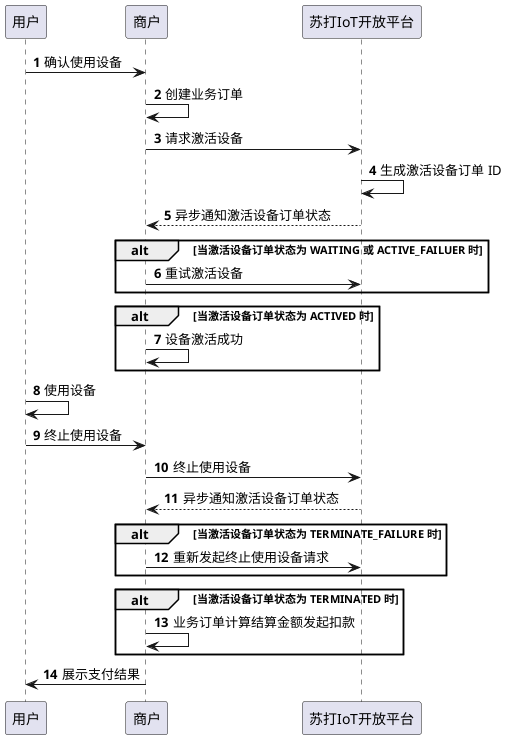

# 苏打 IoT

## 业务流程

### 先享后付联网设备激活流程

```plantuml
@startuml
autonumber
用户          ->  商户            : 确认使用设备
商户           -> 商户            : 创建业务订单
商户           ->  苏打IoT开放平台 : 请求激活设备
苏打IoT开放平台 ->  苏打IoT开放平台 : 生成激活设备订单 ID
苏打IoT开放平台 --> 商户           : 异步通知激活设备订单状态

alt 当激活设备订单状态为 WAITING 或 ACTIVE_FAILUER 时
商户           ->  苏打IoT开放平台 : 重试激活设备
end

alt 当激活设备订单状态为 ACTIVED 时
商户           -> 商户            : 设备激活成功
end

用户          -> 用户             : 使用设备
用户          -> 商户             : 终止使用设备
商户          ->  苏打IoT开放平台  : 终止使用设备
苏打IoT开放平台 --> 商户           : 异步通知激活设备订单状态

alt 当激活设备订单状态为 TERMINATE_FAILURE 时
商户          ->  苏打IoT开放平台   : 重新发起终止使用设备请求
end

alt 当激活设备订单状态为 TERMINATED 时
商户          ->  商户            :  业务订单计算结算金额发起扣款
end

商户        -> 用户               : 展示支付结果
@enduml
```
